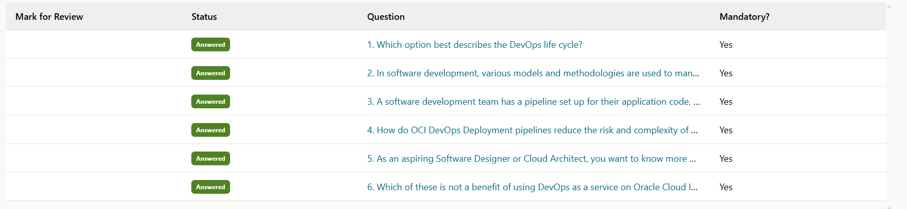

# 📘 Module 01 – Introduction to DevOps

## 1️⃣ Trainer's Lesson Notes

### DevOps Definition

A way of working that enables continuous delivery.

**Key aspects:**
- Encourages collaboration (Dev + Ops + QA/Testing)
- Enables automation
- Instills a continuous culture
- Requires a paradigm shift in mindset and processes

### Why DevOps Matters

Combines Development + Operations = Unified Infrastructure.

**Benefits:**
- Maximizes productivity
- Simplifies the software lifecycle
- Makes each phase programmable & dynamic
- Improves release & deployment frequency
- Enhances predictability, efficiency & security
- Helps in release management
- Finds bugs early

### DevOps Life Cycle

Rapid, multiphased SDLC with strong feedback loops.

**Driven by:**
- Continuous code → build → test → release → deploy → operate → monitor
- Test-driven development ensures robustness
- Every stage monitored and optimized

### CI/CD (Continuous Integration / Continuous Delivery)

**Continuous Integration (CI):**
- Developers integrate frequently
- Bugs/issues exposed earlier

**Continuous Delivery (CD):**
- Tools + best practices to deliver quickly
- Each build delivered for QA, then production

Together they form the backbone of DevOps.

### The "Continuous" Paradigm

**Continuity at all SDLC stages:**
- Continuous development
- Continuous testing
- Continuous integration
- Continuous release
- Continuous deployment
- Continuous monitoring

Feedback loop ensures optimization.

### Benefits of DevOps

**Curated Culture:** connected teams, efficiency, engagement, growth opportunities

**Tighter Tech:** improved quality, faster fixes, stability, continuous delivery

**Better Business:** lower IT costs, faster delivery, predictability, flexibility, innovation

### DevOps in the Cloud

**Managed, cloud-based CI/CD pipeline:**
- Code & bug tracking
- Automated testing & deployment
- Reviewing & monitoring

**Benefits:** saves time, reduces silos, automates deployments, lowers cost

### OCI DevOps as a Service

- Store code privately, integrate external repos
- Build, test, deploy with pipelines
- Orchestrate deployments
- Automate updates & reduce downtime
- Enhance security & reduce risks

### DevOps as a Service – Benefits

- Low risk
- Scalability
- Integration & interoperability
- Automation

### Cloud-Native Enablement

- Microservices & containers
- Kubernetes & service mesh
- Serverless functions & APIs
- Event streaming (Kafka)
- CI/CD pipelines

### Example Case Study: Vision Stays

**Current state:** static website
**Plan:** expand website, add booking functions, integrate with hotel aggregators
**Step 1–2:** Enhance with OCI services (API Gateway, DevOps service, Container Registry, Autonomous DB, OKE, etc.)
**Step 3:** Scale with microservices (booking, hotel, customer services)
**Step 4:** Add monitoring, alerting & logging with OCI (Logging, Monitoring, Alarms, Events)

---

## 2️⃣ Exam & Interview Notes

- DevOps = culture + automation + CI/CD + continuous improvement
- Life cycle = plan → code → build → test → release → deploy → operate → monitor
- OCI DevOps: fully managed CI/CD platform
- Benefits: collaboration, faster delivery, lower cost, scalability, reduced risks
- Cloud-native adoption (containers, Kubernetes, serverless, Kafka) is key for DevOps maturity

**Pitfall to avoid (exam):**
Don't confuse Continuous Delivery (automatic deploy-ready builds) with Continuous Deployment (automatic push to production).

---

## 3️⃣ Beyond Certification (DevOps Engineer's View)

### Tools mapping:
- **Code repo** → GitHub/GitLab
- **Build/test** → Jenkins, GitHub Actions, OCI DevOps Build Pipelines
- **Deploy** → Kubernetes (OKE), Terraform for infra
- **Monitoring** → Prometheus/Grafana, OCI Monitoring/Logging

---

### Real-world workflow:
Developers push → CI runs → Automated tests → Build artifacts → Deploy via OKE → Observability with Grafana → Feedback loop

**OCI advantage:** fully integrated (IAM, Vault, Logging, Monitoring, Events, Notifications)

---

## 📸 Screenshots (Mini-Tests & Practice)

| Test        | Screenshot | Links and Results                                                                         |
|-------------|------------|-------------------------------------------------------------------------------------------|
| Quiz 1      | min-test-1 | |
| Results     | questions  | ✅ Scored 100% in practice accuracy                                                       |
